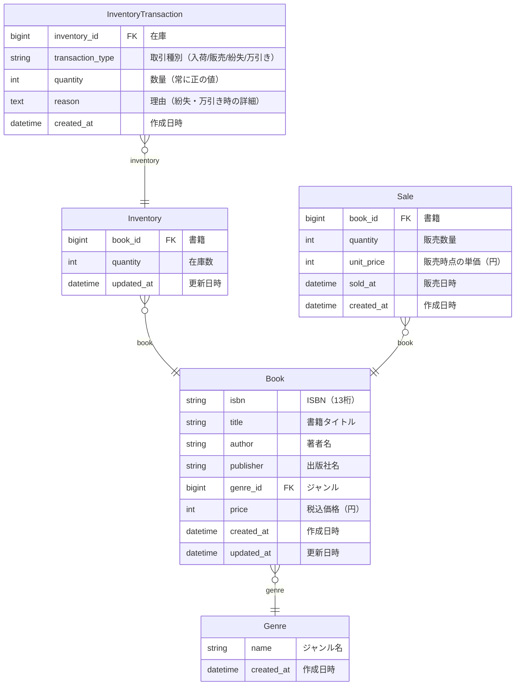

# ER Diagram

---

## Table Definitions

### Genre

ジャンル

| Column | Type | Key | Description | Options |
|--------|------|-----|-------------|---------|
| name | string |  | ジャンル名 | max_length=100, unique=True |
| created_at | datetime |  | 作成日時 | auto_now_add=True |
### Book

書籍

| Column | Type | Key | Description | Options |
|--------|------|-----|-------------|---------|
| isbn | string |  | ISBN（13桁） | max_length=13, unique=True |
| title | string |  | 書籍タイトル | max_length=255 |
| author | string |  | 著者名 | max_length=255 |
| publisher | string |  | 出版社名 | max_length=255 |
| genre_id | bigint | FK | ジャンル | related_name='books', on_delete=PROTECT, to='inventory.genre' |
| price | int |  | 税込価格（円） | - |
| created_at | datetime |  | 作成日時 | auto_now_add=True |
| updated_at | datetime |  | 更新日時 | auto_now=True |
### Inventory

在庫

| Column | Type | Key | Description | Options |
|--------|------|-----|-------------|---------|
| book_id | bigint | FK | 書籍 | related_name='inventory', on_delete=CASCADE, to='inventory.book' |
| quantity | int |  | 在庫数 | default=0 |
| updated_at | datetime |  | 更新日時 | auto_now=True |
### InventoryTransaction

在庫変動履歴

| Column | Type | Key | Description | Options |
|--------|------|-----|-------------|---------|
| inventory_id | bigint | FK | 在庫 | related_name='transactions', on_delete=CASCADE, to='inventory.inventory' |
| transaction_type | string |  | 取引種別（入荷/販売/紛失/万引き） | max_length=10, choices=[('ARRIVAL', 'Arrival'), ('SALE', 'Sale'), ('LOSS', 'Loss'), ('THEFT', 'Theft')] |
| quantity | int |  | 数量（常に正の値） | - |
| reason | text |  | 理由（紛失・万引き時の詳細） | blank=True, default='' |
| created_at | datetime |  | 作成日時 | auto_now_add=True |
### Sale

売上

| Column | Type | Key | Description | Options |
|--------|------|-----|-------------|---------|
| book_id | bigint | FK | 書籍 | related_name='sales', on_delete=PROTECT, to='inventory.book' |
| quantity | int |  | 販売数量 | - |
| unit_price | int |  | 販売時点の単価（円） | - |
| sold_at | datetime |  | 販売日時 | - |
| created_at | datetime |  | 作成日時 | auto_now_add=True |
